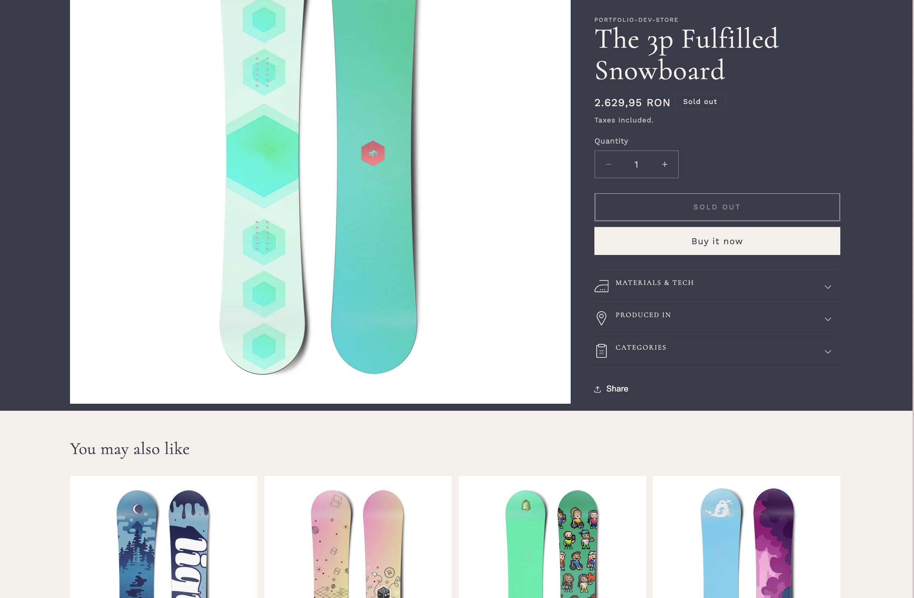
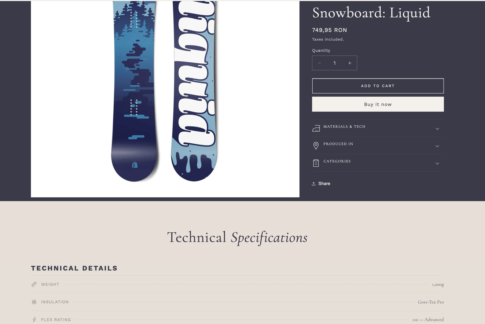

# WinSport — Shopify 2.0 Portfolio Theme


A production-ready Shopify 2.0 theme built on Dawn, demonstrating professional-level skills across theme architecture, design, metafields, custom pricing, JavaScript interactions, and performance optimization.

**[View Portfolio Page](https://artyomzayarny.github.io/shopify-theme/)** &nbsp;|&nbsp; **[Live Store](https://portfolio-dev-store.myshopify.com)**

---

## Before & After

The most dramatic transformation — Phase 3 Dynamic Sections on PDP:

| Before | After |
|--------|-------|
|  |  |

---

## Implementation Phases

| Phase | Feature | Key Skills | Presentation |
|-------|---------|------------|--------------|
| 2 | **Figma → Code** | Mobile-first CSS, serif/sans font pairing, responsive layout | [Slides](https://artyomzayarny.github.io/shopify-theme/phase-2-presentation.html) |
| 3 | **Dynamic Sections** | `` blocks, admin reordering, accordion UI | [Slides](https://artyomzayarny.github.io/shopify-theme/phase-3-presentation.html) |
| 4 | **Metafields** | Text/boolean/image metafields, conditional rendering | [Slides](https://artyomzayarny.github.io/shopify-theme/phase-4-presentation.html) |
| 5 | **App Data Simulation** | `app_data.*` namespace, double-guard pattern, JSON traversal | [Slides](https://artyomzayarny.github.io/shopify-theme/phase-5-presentation.html) |
| 6 | **VAT Pricing** | Per-product tax toggle, bidirectional calculation, sale support | [Slides](https://artyomzayarny.github.io/shopify-theme/phase-6-presentation.html) |
| 7 | **JS Interactions** | Custom Elements, ARIA tabs, pub/sub, IntersectionObserver | [Slides](https://artyomzayarny.github.io/shopify-theme/phase-7-presentation.html) |
| 8 | **Performance** | Deferred CSS, content-visibility, fetchpriority, CSS containment | [Slides](https://artyomzayarny.github.io/shopify-theme/phase-8-presentation.html) |

---

## Tech Stack

| | |
|---|---|
| **Platform** | Shopify Online Store 2.0 |
| **Theme Base** | Dawn v15.4.1 |
| **Templating** | Liquid |
| **JavaScript** | Vanilla JS — Custom Elements, pub/sub, IntersectionObserver |
| **CSS** | Mobile-first, no preprocessors, deferred non-critical loading |
| **Dev Tools** | Shopify CLI, Git feature branches, PR workflow |

## Quick Start

```bash
git clone https://github.com/ArtyomZayarny/shopify-theme.git
cd shopify-theme
shopify theme dev --path=client/ --store=your-store.myshopify.com
```

## License

Built on [Dawn](https://github.com/Shopify/dawn) by Shopify. See [LICENSE](/LICENSE.md) for details.
