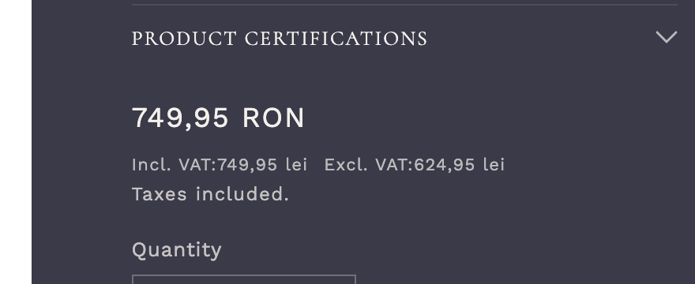
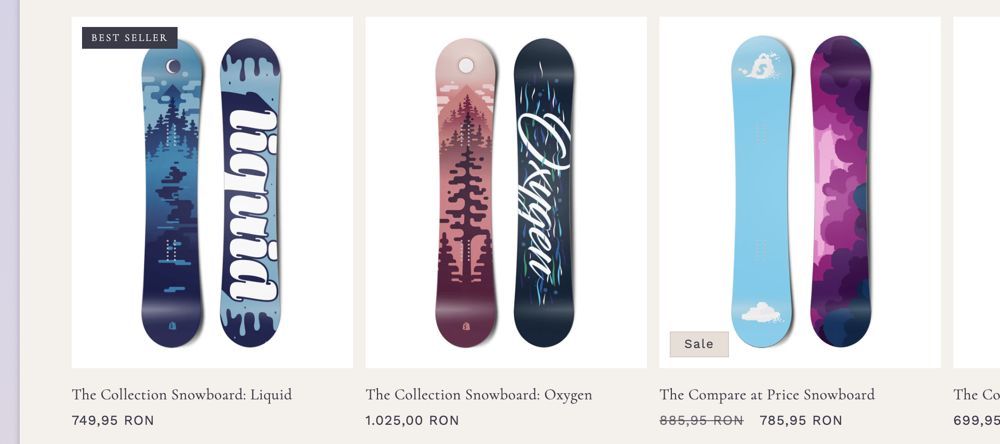

# WinSport — Shopify 2.0 Portfolio Theme

A production-ready Shopify 2.0 theme built on Dawn v15.4.1, demonstrating professional-level skills across theme architecture, design implementation, metafields, custom pricing logic, JavaScript interactions, and performance optimization.

## Live Demo

**Store:** [portfolio-dev-store.myshopify.com](https://portfolio-dev-store.myshopify.com)

## What This Project Demonstrates

| Skill | Implementation |
|-------|---------------|
| **Liquid templating** | Sections, snippets, JSON templates, conditional rendering |
| **Figma → Code** | Pixel-accurate implementation with mobile-first CSS |
| **Shopify 2.0 Sections** | Dynamic blocks, admin-reorderable, custom schemas |
| **Metafields** | Text, boolean, image, JSON — with defensive null checks |
| **App Data Simulation** | `app_data.*` namespace, resilient to app uninstall |
| **Custom Pricing** | VAT inc/exc toggle per product, sale prices across PDP/collection/cart |
| **JavaScript** | Web Components (Custom Elements), pub/sub, IntersectionObserver |
| **Performance** | Deferred CSS, content-visibility, fetchpriority, srcset/WebP |
| **Git Workflow** | Feature branches per phase, meaningful commits, PR descriptions |

## Screenshots

### Homepage — Hero Banner


### Product Page — Tabs & Variant Description


### Product Page — VAT Pricing


### Sticky Add to Cart


### Collection Page — App Data Badge


## Implementation Phases

### Phase 0-1: Bootstrap & Theme Structure
Dawn theme cloned, renamed to "WinSport Portfolio Theme". Sections/snippets architecture, JSON templates for product, collection, cart pages.

### Phase 2: Figma → Code
Warm beige + navy design system with serif/sans font pairing. Mobile-first responsive layout, no page builders. Custom hero banner with full-viewport design.

### Phase 3: Dynamic Sections
Custom "Product Specs Showcase" section with dynamic blocks (accordion items). Admin can add, remove, and reorder specs from Theme Customizer.

### Phase 4: Metafields
Product metafields (`custom.materials_text`, `custom.is_featured`, `custom.extra_image`) rendered on PDP with conditional display — only shown when populated.

### Phase 5: App Data Simulation
`app_data.*` namespace metafields simulating third-party app data. Badge on collection cards, certifications accordion on PDP. Double-guard pattern: existence check + value check.

### Phase 6: Custom VAT Pricing
Per-product VAT toggle via `custom.show_vat` boolean metafield. Price snippet displays "incl. VAT" / "excl. VAT" with configurable tax rate. Supports `compare_at_price` (sale) across PDP, collection, and cart.

### Phase 7: JavaScript Interactions
Three Web Components following Dawn's native patterns:
- **`<product-tabs>`** — ARIA tablist with keyboard navigation (Arrow/Home/End)
- **`<variant-description>`** — Subscribes to `variantChange` pub/sub event, shows variant-specific text
- **`<sticky-atc>`** — IntersectionObserver on main ATC button, fixed bottom bar with delegated form submit

Zero dependencies, conditional loading (JS/CSS only when block is added).

### Phase 8: Performance
- Deferred 7 render-blocking CSS files via `media="print" onload="this.media='all'"` pattern
- `content-visibility: auto` on below-fold sections with `contain-intrinsic-size`
- `fetchpriority="high"` on hero/LCP images
- CSS containment on card media for isolated reflow
- Dawn baseline: srcset (7 breakpoints), lazy loading, WebP via Shopify CDN

## Tech Stack

- **Platform:** Shopify Online Store 2.0
- **Theme Base:** Dawn v15.4.1
- **Templating:** Liquid
- **JavaScript:** Vanilla JS — Custom Elements, pub/sub, IntersectionObserver
- **CSS:** Mobile-first, no preprocessors, deferred non-critical loading
- **Dev Tools:** Shopify CLI, GitHub Actions

## Quick Start

```bash
# Clone the repo
git clone https://github.com/ArtyomZayarny/shopify-theme.git
cd shopify-theme

# Start local dev server
shopify theme dev --path=client/ --store=your-store.myshopify.com

# Push to store
shopify theme push --path=client/

# Run theme linting
shopify theme check --path=client/
```

## Project Structure

```
├── README.md
├── CLAUDE.md              # AI assistant instructions
├── goal.md                # Full specification (Ukrainian)
├── plan.md                # Implementation plan
├── client/                # Shopify theme files
│   ├── assets/            # CSS, JS, images
│   │   ├── winsport-custom.css       # Design system overrides
│   │   ├── component-price-vat.css   # VAT pricing styles
│   │   ├── product-tabs.js           # <product-tabs> Web Component
│   │   ├── variant-description.js    # <variant-description> Web Component
│   │   └── sticky-atc.js             # <sticky-atc> Web Component
│   ├── config/            # Theme settings
│   ├── layout/            # theme.liquid
│   ├── locales/           # Translations
│   ├── sections/          # Admin-configurable sections
│   ├── snippets/          # Reusable partials
│   │   ├── image.liquid              # Optimized responsive images
│   │   ├── price.liquid              # VAT-aware price display
│   │   └── product-metafields.liquid # Metafield conditional rendering
│   └── templates/         # JSON page templates (Shopify 2.0)
└── docs/
    ├── screenshots/       # Phase screenshots
    └── phase-*-presentation.html  # Reveal.js slide decks
```

## Presentations

Each phase has a Reveal.js presentation documenting the implementation:

- [Phase 2: Design Implementation](docs/phase-2-presentation.html)
- [Phase 3: Dynamic Sections](docs/phase-3-presentation.html)
- [Phase 4: Metafields](docs/phase-4-presentation.html)
- [Phase 5: App Data Simulation](docs/phase-5-presentation.html)
- [Phase 6: VAT Pricing](docs/phase-6-presentation.html)
- [Phase 7: JavaScript Interactions](docs/phase-7-presentation.html)
- [Phase 8: Performance](docs/phase-8-presentation.html)

## License

This project is built on [Dawn](https://github.com/Shopify/dawn) by Shopify. See [LICENSE](/LICENSE.md) for details.
